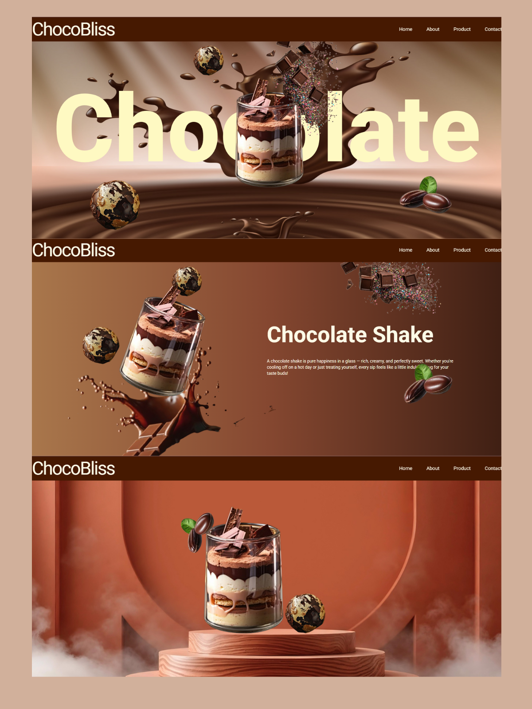

## <h1 align="center">🍫🥤 ChocoBliss</h1>

<strong>ChocoBliss</strong> is an animated landing page designed using <strong>React</strong>, <strong>Tailwind CSS</strong>, and <strong>GSAP</strong>. This website showcases scroll-based animations with custom image transitions triggered by scrolling.

  
  
  

## 🚀 Live Site

[Live Site](https://simple-chocobliss-site.netlify.app/)

## ✨ Features

- Scroll-triggered animations using **GSAP ScrollTrigger**
- chocolate-themed visuals with layered images
- Hero, About, and bottom sections with animated chocolate elements
- Styled with **Tailwind CSS**
- Component-based structure using React
- Clean animation separation via a reusable GSAP hook 

